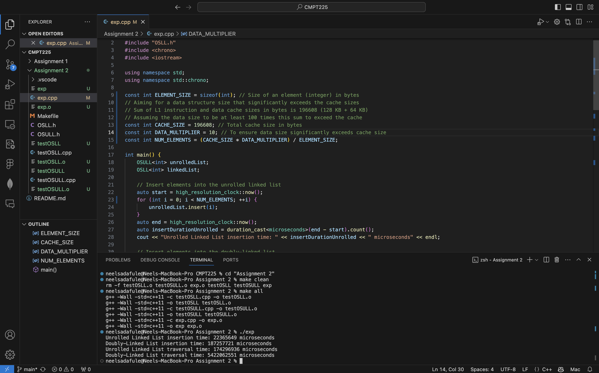

# Performance Comparison of Unrolled and Traditional Doubly-Linked Lists

**Neel Sadafule**

*Date: March 10, 2024*

## Experiment Description

In this experiment, our objective was to compare the performance of unrolled linked lists (OSULL) with traditional doubly-linked lists (OSLL) in terms of insertion and traversal times. The rationale for this comparison is to explore the impact of data structure design on performance, particularly focusing on CPU cache efficiency. We performed the experiment by inserting a significant number of integer elements into each data structure, then measured the time required for traversal. This approach aimed to simulate a scenario where the sizes of the data structures significantly exceed the CPU cache size, to induce realistic cache behavior.

**Key parameters of the experiment:**
- **Node Capacity for OSULL:** 10 (default)
- **List Item Data Type:** Integer (`int`)
- **List Size:** Determined to significantly exceed CPU cache size
- **Number of Items:** Approximately 196,608,000 bytes worth of integers

## Data Summary

The performance measurements are summarized in the table below:

| Operation         | OSULL (microseconds) | OSLL (microseconds) |
|-------------------|----------------------|---------------------|
| Insertion Time    | 22,365,649 (22.4 secs) | 187,257,721 (3.1 mins) |
| Traversal Time    | 174,296,936 (2.9 mins) | 5,422,062,551 (90.3 mins) |

## Interpretation of Data

The collected data indicates a significant performance advantage of OSULL over OSLL for both insertion and traversal operations. The insertion time for OSULL is nearly an order of magnitude lower than that for OSLL, and the traversal time shows an even more pronounced difference, suggesting that the design of OSULL, which minimizes pointer chasing and maximizes cache locality, greatly improves performance.

## Additional Observations

An intriguing aspect of this experiment was observing the profound effect of data structure design on traversal efficiency. The vast difference in traversal times highlights the critical role of CPU cache behavior in software performance, with OSULL demonstrating superior cache efficiency. This experiment not only confirms theoretical advantages but also showcases the practical benefits of considering hardware characteristics in data structure design. Furthermore, it emphasizes the importance of balancing algorithmic complexity with hardware performance considerations for optimal software optimization.

## Raw Experiment Data

